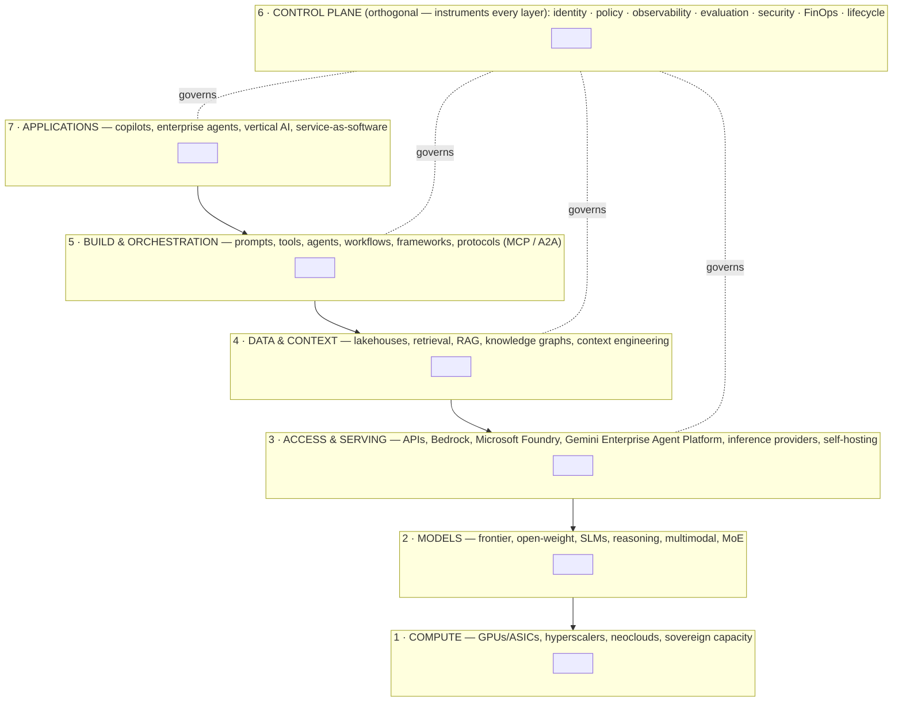

# The Enterprise AI Mental Model — Seven Layers, One Map

> **Why this document exists:** Almost every confusing vendor pitch, architecture debate or budget line becomes legible once you can place it on this map. The layers are where *decisions* get made — even though vendors deliberately bundle across them.

---

## The one-page map

**Cross-cutting (outside the stack, shaping all of it):** regulation, risk, evaluation discipline, security, change management, operating model.

Three honest caveats before the layer detail — these are what separate a real 2026 mental model from a 2024 slide:

1. **Layers 2 and 3 fuse for most buyers.** If you consume models via API (the overwhelming majority), "models" and "serving" arrive as one product. The separation is only real if you self-host (archetype 6).
2. **Layer 6 is a plane, not a stratum.** The control plane instruments every layer; drawing it as a box between orchestration and applications understates it.
3. **Vendors collapse layers on purpose.** Hyperscalers span 1–6; Microsoft spans 2–7; Databricks/Snowflake absorb 4–6; model labs integrate down (compute deals) and up (applications). The layers describe *your decisions*, not their org charts. The strategic axis this creates — **integrated platform vs best-of-breed** — recurs in every later document.

---

## Layer 1 — Compute & Infrastructure

**What it does:** supplies the raw processing (training and inference), memory, networking, power and data-centre capacity everything else runs on.

**Why it exists:** model capability and inference economics are physically bounded by silicon and power. Inference is now roughly two-thirds of AI compute — the layer's centre of gravity moved from training clusters to inference fleets.

**State of play (Sept 2026):** a historic capex supercycle — the big four hyperscalers plan **~$600–700B+ capex in 2026**, up ~60%+ on 2025. NVIDIA remains the default (Vera Rubin generation in production from mid-2026; it also absorbed Groq's inference silicon in a ~$20B deal), AMD is a credible rack-scale second source, and hyperscaler custom chips (Google TPU v7, AWS Trainium3 at >1M chips deployed, Microsoft Maia 200) are real at scale — mostly for inference, which is what lets clouds keep cutting token prices. Neoclouds (CoreWeave, Nebius, Lambda, Crusoe) are a ~$20B market functioning as a price/availability release valve. Sovereign programs (EU Gigafactories, Gulf states) are a material demand line; **Australia's "sovereign" capacity is mostly onshore regions of US clouds** (OpenAI's ~$7B Sydney campus, AWS's ~A$20B expansion) — a gap ASPI and others flag.

**Decisions made here:** rent vs reserve vs own; hyperscaler vs neocloud vs sovereign; how long to commit in a falling-price market. *Most enterprises never touch this layer directly — but its economics flow through every price you pay.*

**Standardised:** raw GPU-hours at the low end. **Lock-in:** CUDA ecosystem, multi-year capacity contracts, cloud commit agreements.

---

## Layer 2 — Models

**What it does:** provides the trained intelligence — the thing that reasons, writes and decides.

**Why it exists:** frontier capability is concentrated in a handful of labs because training requires Layer-1 scale; the open-weight ecosystem trades peak capability for control, cost and sovereignty.

**State of play (Sept 2026):** verified flagships — OpenAI **GPT-5.6** (Sol/Terra/Luna tiers), Anthropic **Claude Fable 5 / Opus 5** (plus Sonnet 5, Haiku 4.5), Google **Gemini 3.x** (3.1 Pro flagship, Flash workhorses), xAI Grok 4.6. The open-weight frontier is now **Chinese-led** — DeepSeek V4 (MIT licence), Qwen 3.5/3.6 (Apache 2.0), Kimi K3 — sitting ~3–9 months behind closed frontier; Meta has reportedly pivoted away from open Llama. Three structural facts an executive needs: (a) all flagships are **reasoning-native** with a tunable "effort" dial, so cost per query is variable, not fixed; (b) nearly everything is **MoE** (mixture-of-experts), the architecture behind capability getting cheaper; (c) **small models** now handle a large share of enterprise volume (classification, extraction, routing) at 10–30× lower cost.

**Decisions made here:** model *portfolio* (which 2–3 labs + an open option), routing policy across price tiers (the biggest cost lever in the stack), single-lab dependence risk, whether Chinese-origin open weights pass your procurement bar. Assume any model you standardise on is obsolete in 6–9 months — **build for swappability, not for a model**.

**Standardised:** mid-tier capability (fast followers replicate in months). **Lock-in:** low at the API level; real via fine-tunes, model-tuned prompts/evals, and provider-specific features.

---

## Layer 3 — Access & Serving

**What it does:** delivers models to applications — first-party APIs, cloud model platforms, specialist inference providers, or self-hosted serving.

**Why it exists:** it separates model choice from operational concerns — identity, networking, quotas, billing, compliance boundaries, procurement.

**State of play:** the three cloud platforms converged on the same shape (model catalogue + inference + safety + evals + agent tooling): **Amazon Bedrock**, **Microsoft Foundry** (renamed from Azure AI Foundry), **Gemini Enterprise Agent Platform** (ex-Vertex AI). Claude is the only frontier family on all three clouds; GPT is Azure/OpenAI-first; Gemini is Google-only. Specialist inference providers (Together, Fireworks, Groq, Cerebras) compete on price and speed — the same open model varies ~6× in price across providers, and custom-silicon providers serve 5–10× faster than GPU baselines, which matters when agent latency compounds across chained calls. Discounts are structural: **batch = 50% off; cached input ≈ 90% off; stackable**.

**Decisions made here:** direct API vs cloud platform vs gateway-mediated multi-provider; whether AI spend draws down existing cloud commitments; the self-host threshold (usually data control or unit cost at very high volume — rarely capability).

**Standardised:** the inference API shape itself (OpenAI-compatible is the lingua franca). **Lock-in:** cloud commit contracts, platform-native agent runtimes and safety tooling annexed onto serving.

---

## Layer 4 — Data & Context

**What it does:** turns enterprise data into model-usable context — warehouses/lakehouses, retrieval (vector + keyword + reranking), RAG pipelines, knowledge graphs, agent memory, and the discipline now called **context engineering**.

**Why it exists:** models are stateless and generic. Differentiated value comes from *your* data reaching the model accurately, freshly, and with permissions enforced. **This layer is where most production failures originate** (data quality, permissions, stale indexes).

**State of play:** the 2024 mental model ("RAG = vector database + embeddings") is dead; retrieval is not. Long context windows (1M+ tokens) killed *lazy* retrieval, but retrieval remains 1–2 orders of magnitude cheaper per query, enforces access control (context-stuffing cannot), and handles corpora no window can hold. The 2026 production pattern: **hybrid search (keyword + vector) + reranking narrows candidates → the long context window reasons over them → increasingly, an agent decides what to retrieve just-in-time via tools.** Standalone vector databases are losing share as retrieval gets absorbed into data platforms (Databricks, Snowflake, Postgres). Knowledge graphs (GraphRAG) earn their cost only for relationship-heavy, multi-hop questions. Permission-aware retrieval — document ACLs flowing correctly into agent context — remains a hard, partially unsolved problem and a major driver of Layer 6 identity work.

**Decisions made here:** lakehouse-native retrieval vs separate infrastructure; freshness architecture; the permissions model (the make-or-break); buy (Glean-style) vs build; where agent memory lives.

**Standardised:** embeddings, vanilla vector search (now a database feature). **Lock-in:** **data gravity — the strongest lock-in in the entire stack** — plus catalogue/governance metadata and platform-specific agent-to-data bindings.

---

## Layer 5 — Build & Orchestration

**What it does:** where applications get constructed — prompts, tools, agent loops, workflows, multi-agent coordination, SDKs, and the interop protocols.

**Why it exists:** raw model APIs don't ship products. This layer packages reasoning + tools + state + control flow into reliable software.

**State of play:** two distinct markets. (a) **Managed agent platforms** — Copilot Studio, Bedrock AgentCore, Agentforce, watsonx Orchestrate — governed, procurement-friendly, inherit tenant identity. (b) **Open SDKs** — LangGraph (largest enterprise footprint), Microsoft Agent Framework 1.0 (AutoGen + Semantic Kernel merged, GA Apr 2026), OpenAI Agents SDK, Google ADK, Claude Agent SDK, CrewAI, PydanticAI. The settled engineering consensus: **workflows (predefined paths) beat agents (dynamic control flow) wherever the path is predictable**; default to a single well-tooled agent; use orchestrator + context-isolated subagents only for parallelisable, read-heavy work. Agent runtimes — sandboxing, durable checkpointed execution, long-running tasks — emerged as their own infrastructure category. **Protocols are the standardisation story:** MCP (agent↔tools; Linux Foundation's Agentic AI Foundation since Dec 2025; ~100M monthly SDK downloads, 10k+ servers) and A2A (agent↔agent; v1.0 2026; same foundation since Aug 2026). Caveat from the academic literature: they standardise *plumbing*, not *policy* — delegation semantics and liability remain unexpressed.

**Decisions made here:** platform vs SDK (inherited governance vs flexibility); MCP-first tool surface; how much determinism to impose; framework churn risk — **betting on protocols is safer than betting on frameworks**.

**Standardised:** agent loops, tool-calling formats (via MCP). **Lock-in:** platform runtimes (Copilot Studio / Agentforce flows are not portable); evals and behaviour tuned to one model family.

---

## Layer 6 — Control Plane

**What it does:** identity, permissions, policy, observability, evaluation, security, cost governance and lifecycle management for everything above — increasingly with **agents as first-class governed entities**.

**Why it exists:** an agent that acts on real systems is an employee from a risk perspective. It needs an identity, scoped permissions, a budget, supervision, an audit trail, and offboarding. Without this layer, agents don't pass security review and pilots die.

**Is it real in 2026? Yes — as a category-in-formation, not one product.** Evidence: **Microsoft Agent 365** (GA May 2026, ~$15/user/mo — registry, Entra Agent ID, Purview/Defender integration, covers third-party agents); **Entra Agent ID GA (Apr 2026)** and **Okta agent identity products (Aug 2026)** built on IETF OAuth drafts; **AWS AgentCore Identity + Policy** (Cedar-based, default-deny, GA Mar 2026); Salesforce/MuleSoft **Agent Fabric**; Databricks Unity AI Gateway; Snowflake Cortex AI Gateway; a wave of AI/agent gateways acting as policy enforcement points; Gartner's "guardian agents" category. Evaluation and observability merged into one loop (production traces become eval datasets). FinOps went mainstream: **98% of FinOps teams now manage AI spend** (vs 31% two years ago). Enterprises assemble the control plane from parts; consolidation is coming.

**Decisions made here:** where the policy enforcement point lives (gateway vs platform-native vs both); one control plane per cloud vs a neutral overlay; the agent identity provider; who owns evals; incident response for agent actions. **Whoever owns the enforcement point owns the stack's choke point** — this layer is contested precisely because layers 2–3 commoditised.

**Standardised:** basic logging, routing, rate limiting; OpenTelemetry GenAI conventions are the de facto trace format (nuance: still officially unstable). **Lock-in:** the enforcement point itself; identity ecosystems extending their human-identity duopoly to agents.

---

## Layer 7 — Applications

**What it does:** delivers outcomes — copilots (assist), enterprise agents (delegated work), vertical AI (domain depth), AI-native products, and service-as-software (selling completed work).

**State of play:** suite incumbents embed agents (M365 Copilot, Agentforce, ServiceNow, SAP Joule, Gemini Enterprise); vertical AI leaders reached real scale (Harvey ~$200M ARR in legal, Sierra ~$200M in customer service, Abridge in clinical documentation); and — the biggest competitive fact — **the model labs' own surfaces (ChatGPT Enterprise, Claude, Gemini) are simultaneously the most-adopted enterprise AI applications.** Thin GPT-wrappers are a dead category. Applications increasingly expose themselves as tools/agents to other applications via MCP/A2A — the app layer is becoming recursively composable with layer 5.

**Decisions made here:** buy vertical vs build on platform; suite-native vs best-of-breed; how app-layer agents get governed by your (separately procured) control plane; pricing-model exposure (seats vs consumption vs outcomes).

**Standardised:** generic chat-with-your-documents. **Lock-in:** workflow embedment, accumulated domain evals and guardrails, data feedback loops, change-management investment.

---

## The cross-cutting concerns (why they're not layers)

| Concern | Why it cuts across | The one thing to remember |
|---|---|---|
| **Evaluation** | Spans build-time (regression gates) and runtime (monitoring); connects layers 2, 5, 6, 7 | Enterprises with eval discipline are the ones that can swap models and ship agents |
| **Security** | Prompt injection enters at layer 7, exploits layer 5, exfiltrates via layer 4 | Unsolved in general; containment (least privilege, sandboxing, human gates) is the defence |
| **Identity** | Users at layer 7, agents at layer 5, services everywhere | An agent without governed identity cannot be permissioned, audited or revoked |
| **FinOps** | Costs accrue at layer 3, are caused at layers 5–7 | Manage cost per *task*, not per token; budget caps double as safety controls |
| **Regulation** | Regulates uses (layer 7), models (layer 2), and transparency (everywhere) | Sector regulators bite sooner than horizontal AI law for most enterprises |
| **Change management** | Decides whether any of the above creates value | The evidence says this, not model capability, is the gating factor |

---

## So what? — the three questions this map lets you ask

1. **"Which layer does this product actually live in, and which layers does it annex?"** (An "AI platform" that bundles 3–6 is selling convenience *and* lock-in — price both.)
2. **"At which layer are we differentiated?"** (Almost always layer 4 — your data — and layer 7 — your workflows. Almost never layers 1–3. Spend accordingly.)
3. **"Where is our enforcement point, and who controls it?"** (If the answer is "the vendor's", you have delegated your control plane.)
