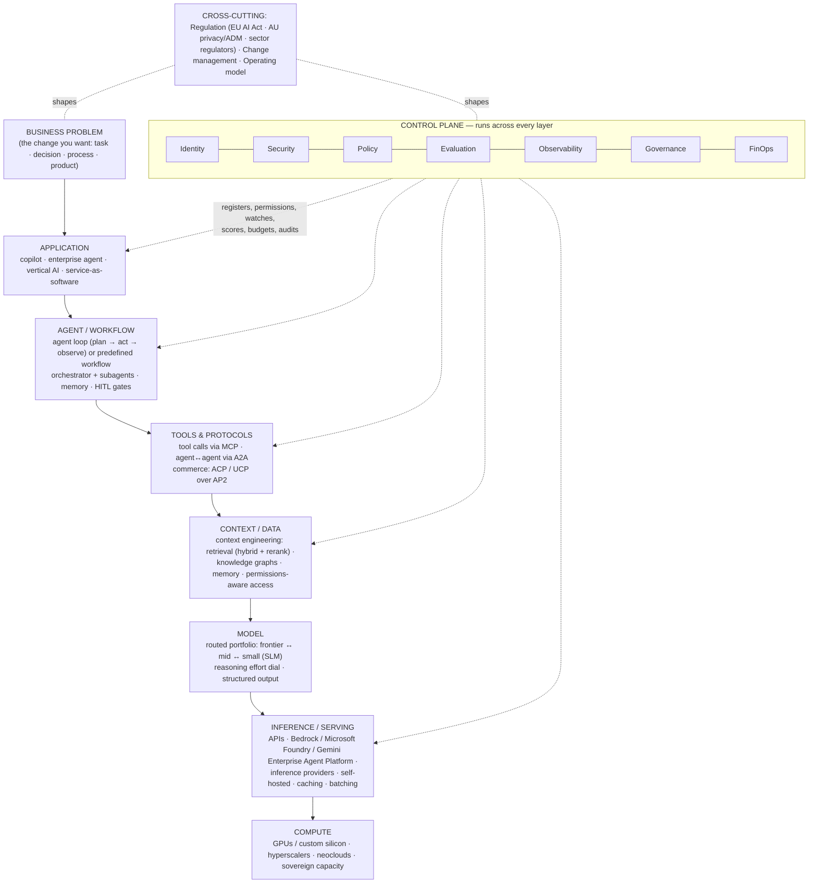
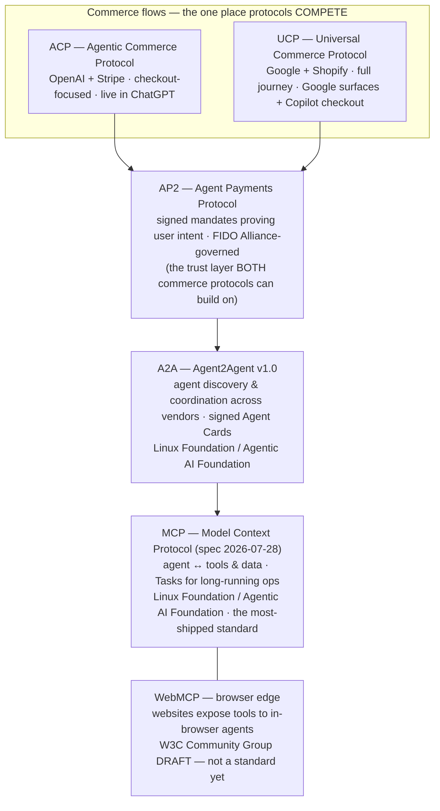

# Architecture — How Everything Fits Together

> **Why this document exists:** the mental model ([02](02_ENTERPRISE_AI_MENTAL_MODEL.md)) gives you the layers; this document shows the *moving parts in action* — the master map, the protocol wiring, and one complete worked example that places every major concept from the glossary in sequence.

---

## 1. The Master Map — Enterprise AI 2026

**How to read it:** value flows top-down (a business problem becomes tokens on silicon); constraints flow from the right (the control plane) and outside (regulation, change). Note what the map implies: the model is *one box of eight*. Enterprises that treat "which model?" as the whole decision are ignoring seven-eighths of the architecture.

---

## 2. The protocol wiring (verified, September 2026)

**The three facts that correct the common one-liner:** (1) "ACP" is ambiguous — IBM's Agent Communication Protocol *merged into A2A* in Aug 2025; the surviving ACP is OpenAI/Stripe's commerce protocol. (2) ACP and UCP are not complementary layers — they are the **competing pair** (merchants implement both). (3) **AP2 is the usually-omitted piece**: the FIDO-governed payments-authorization layer beneath both, and arguably the most durable part of the commerce stack. Everything else complements across layers, and MCP + A2A now sit under one neutral foundation — which is why "build MCP-first" is the safest integration bet in the stack.

---

## 3. The worked example — one request, end to end

> **Scenario:** a program manager asks the enterprise assistant: *"Check whether Project Aurora is at risk of missing its March milestone; if so, recommend an action and update the risk register."*
>
> Cross-industry by design — swap in a loan application, a compliance review, or a maintenance schedule and the architecture is identical.

### The walkthrough

**Step 1 — User → Application** *(Layer 7)*
The PM types into the company's assistant (an M365 Copilot agent, a Gemini Enterprise agent, or a custom app — archetype 2, 3 or 4). The application authenticates the *user* (SSO) and starts an auditable session.
*Glossary concepts in play: application, copilot, assistant seat.*

**Step 2 — Application → Agent** *(Layer 5)*
The request routes to a **Project Risk agent** — a governed piece of software with its own **agent identity** (an Entra Agent ID / AgentCore Identity), an owner, and a permission set scoped to project systems. The agent runs in a managed **runtime** (sandboxed, checkpointed — this is a **long-running task**, not one chat turn). Because the request ends in a *write* to a business system, the agent's definition includes a **human-in-the-loop gate** before that step.
*Concepts: agentic AI, agent identity, runtime isolation, long-running task, HITL.*

**Step 3 — Agent → Model (planning)** *(Layers 5→2)*
The agent's first model call — routed to a mid-tier model at moderate **reasoning effort** — produces a **plan**: (a) pull milestone status, (b) pull schedule and dependency data, (c) analyse slippage, (d) draft recommendation, (e) propose register update. The plan is logged as part of the **trajectory**.
*Concepts: planning, reasoning model, routing, trajectory.*

**Step 4 — Agent → Context (retrieval)** *(Layer 4)*
The agent needs project knowledge. **Context engineering** machinery assembles the window: **hybrid retrieval** (keyword + vector) over the project document corpus pulls candidate status reports; a **reranker** keeps the genuinely relevant few; the agent also reads its **memory** of prior sessions on this project. Critically, retrieval is **permissions-aware**: it can only surface documents *this user* is entitled to see — the query runs under the user's delegated authority, not a super-user account.
*Concepts: RAG, reranking, context engineering, memory, grounding, permissions-aware retrieval.*

**Step 5 — Agent → Tools via protocol** *(Layer 5, MCP)*
Static documents aren't enough; the agent needs *live* data. It calls the scheduling system's **MCP server**: `get_milestone_status("Aurora")`, `get_critical_path("Aurora")`. Each **tool call** first passes the **policy engine** (Cedar/OPA-style, default-deny): *is this agent, acting for this user, allowed to call this tool with these parameters?* Allowed calls execute against the external system using a short-lived, scoped, user-bound token (the on-behalf-of pattern); results return as **structured output**.
*Concepts: MCP, tool calling, policy engine, agent identity delegation, structured output.*

**Step 6 — Model (analysis)** *(Layer 2 via Layer 3)*
With curated context — retrieved documents, live tool results, the plan — the agent makes its main model call, now routed to a **frontier-tier** model at high reasoning effort (this is the step that deserves the expensive model). The model concludes: two critical-path tasks have slipped 9 days; vendor delivery is the driver; milestone at risk. It drafts a recommendation (re-sequence testing; escalate the vendor) **grounded** with citations to the retrieved sources. The API call itself benefits from **prompt caching** (the stable system context is ~90% cheaper on re-use).
*Concepts: frontier model, routing, grounding/citations, caching, tokens in/out.*

**Step 7 — Agent → External system (the gated write)** *(Layers 5→7)*
The agent now wants to update the risk register. This is the consequential action, so the **HITL gate** fires: the agent *proposes* a structured change (propose/commit separation — the PM sees the actual payload, not just the agent's summary, defending against **ASI09 trust exploitation**). The PM approves. The write executes via the register's MCP tool — again through the policy engine, again logged. Had this involved *paying* a vendor, an **AP2 mandate** would prove the human authorised it.
*Concepts: HITL, propose/commit, guardrails-as-architecture, agentic commerce (AP2).*

**Step 8 — Result → User** *(Layer 7)*
The PM receives: risk assessment, cited evidence, recommendation, and confirmation of the register update. Elapsed: a couple of minutes; model spend: a few tens of cents across ~6 model calls and 4 tool calls.

**Step 9 — Evaluation** *(Control plane)*
The full **trajectory** — plan, retrievals, tool calls, approval, outputs — was traced (OpenTelemetry GenAI format) into the observability platform. A sampled **online eval** (an **LLM-as-judge**, calibrated against human ratings) scores the trajectory: right tools? faithful to sources? Did it need the approval loop? Failures become new **offline eval** cases that gate the agent's next version — the eval-driven development loop.
*Concepts: observability, trajectory evals, LLM-as-judge, online/offline evals, drift monitoring.*

**Step 10 — Governance & audit** *(Control plane)*
The session's cost posts to the project's **FinOps** showback (the agent has a monthly **budget cap** — economics *and* runaway-agent safety in one control). The audit trail — which identity did what, under whose authority, seeing what data, approved by whom — satisfies internal audit and, for an Australian enterprise, feeds the records you'll want for **APRA expectations** (if regulated) and for **ADM transparency** duties (from 10 Dec 2026). The agent itself appears in the enterprise **agent registry** (Agent 365 / Agent Fabric / AgentCore class), with an owner, a review date, and a kill switch.
*Concepts: AI FinOps, budget caps, audit, agent registry, control plane, regulation.*

### What the example teaches

1. **One user request = many model calls at different tiers.** The economics live in routing (steps 3 vs 6), caching, and the HITL ratio — not in any single price-per-token.
2. **Security lives at the tool call, not the conversation.** The policy engine and delegated identity (steps 5, 7) are the real controls; the model's good intentions are not a control.
3. **The agent never had super-user access.** Every read and write happened under the *user's* delegated, scoped authority — the pattern that makes permissions-aware AI possible.
4. **Evaluation is a loop, not a gate.** Production traces became tomorrow's test cases (step 9); that loop is what lets you swap models and versions with confidence.
5. **Every box was a purchasable product or a buildable component.** Archetype choice ([04](04_BUILD_ARCHETYPES.md)) decides which boxes you inherit and which you own.

---

## 4. Where the boundaries blur (so diagrams don't mislead you)

- **Models + serving fuse for API buyers** — you buy them as one thing unless you self-host.
- **Tools are both "context" and "action"** — MCP sits on the Layer 4/5 boundary deliberately; just-in-time retrieval *is* a tool call.
- **Agent platforms straddle layers 4–7** — AgentCore, Foundry, Gemini Enterprise Agent Platform and Agent Bricks each bundle context, orchestration, runtime and chunks of the control plane. The layers remain *your decision map* even when the invoice is one line.
- **Applications become tools for other applications** — anything exposing an MCP server is simultaneously a Layer-7 product and a Layer-5 component. The stack is becoming recursively composable, which is precisely why identity and policy (not org charts) have to carry the trust model.
